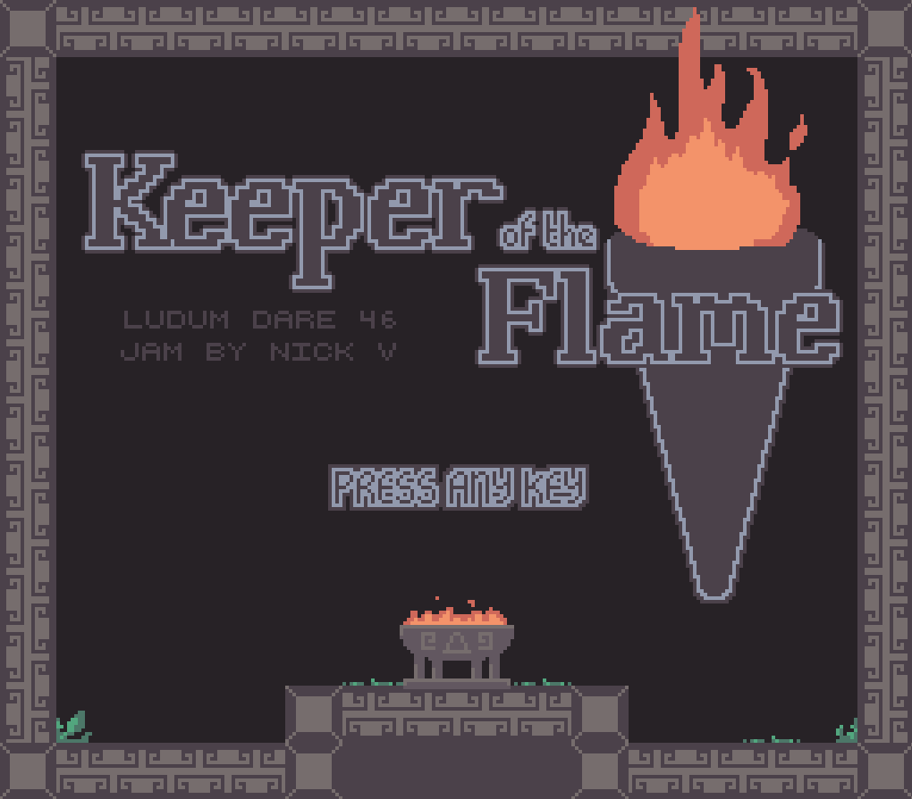

# ld46-keeper-of-the-flame
Keeper of the Flame is an entry for the [Ludum Dare 46 game jam](https://ldjam.com/events/ludum-dare/46). It was created over the course of three days, from April 17th 2020 to April 20th 2020.

## Running KotF
Keeper of the Flame was created in [Game Maker Studio 2](https://www.yoyogames.com/). The subfolder `kotf` is the Game Maker project.

## License
Please feel free to use the _code_ under the permissive MIT License (i.e. you can use, modify, copy, distribute, etc) without needing to ask my permission or credit me (although credit is highly appreciated!)

I would ask that you do _not_ copy or distribute the art, music, or general concepts. Thank you!

## Credits
- Pixel fonts by [Chevy Ray](https://chevyray.itch.io/pixel-fonts)
